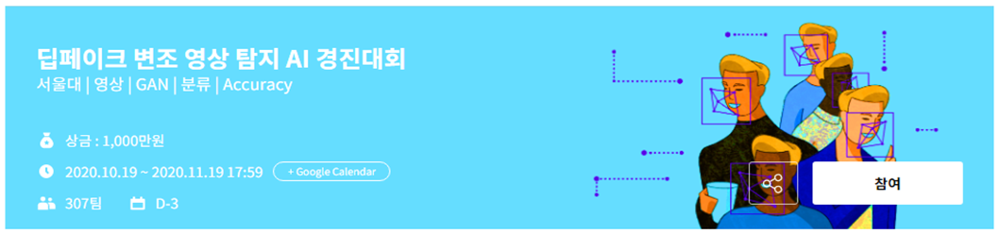

# deep_fake_detection
deep_fake_detection project

##### 주최: 서울대학교 AI 연구원, 인공지능 연구실(DSAIL), 머니브레인 
##### 주관: 데이콘
##### 후원: 한국정보화진흥원(NIA)

## 팀명: 알4go

## Public  
### 점수: 0.94292         
### 등수: 5등

## Private 
### 점수: 0.93902	
### 등수: 6
        

